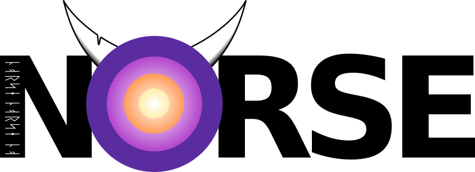

NORSE -- NOn-linear Relativistic Solver for Electrons
=====================================================



Installation and usage
----------------------
NORSE is a Matlab program. No compilation or external libraries are required, 
except that runawayRegionMode = 3 requires Matlab's Curve Fitting Toolbox. A 
detailed description of the usage, available settings, and various output 
quantities is given in the file NORSE.m in the folder @NORSE. See also the files 
in the examples folder. Examples of how to access and process the output are 
given in the various methods of the Plot class (see Plot.m in @Plot).

To use NORSE in a MATLAB script, either add the `src` directory permanently to
your MATLAB path, or for the current session by running
```matlab
addpath('/path/to/NORSE/src/')
```
(or by putting this line at the top of your MATLAB script).

NORSE files
-----------
Each folder starting with a `@` under `src` contains the files for a class with the corresponding name 
(without the `@`). Inside the folder, the file with the same name as the folder is the main 
file of that class. The classes are:

+ **NORSE**
  
  Main class for performing a NORSE calculation.

+ **Grid**

  Class that describes the finite-difference grid in a NORSE calculation, and 
  associated quantities such as finite-difference derivatives. Also contains 
  various methods for manipulating the grid.

+ **TimeAdvance**

  Abstract class that handles the advancement of the NORSE system in time.

  + *TAAdaptive*

    Subclass that implements an adaptive-time-step time-advancement scheme

  + *TADirect*
    
    Subclass that advances the system using direct matrix inversion (LU)

  + *TAInductiveE*
    
	Subclass that solves for both the distribution and the electric-field 
	evolution, self-consistently

  + *TAIterative*
    Subclass that advances the system using indirect matrix inversion (GMRES). 
	This is usually faster than the direct approach
           
+ **Potentials**
  Handles the calculation of the potentials of the Braams & Karney collision operator.
			
+ **CollisionOperator**

  Abstract class that describes the electron-electron and electron-ion 
  collision operators, as well as artificial damping at the boundary of the 
  momentum grid. 

  + **CNonLinear**

    Sub class that implements the nonlinear realativistic Braams & Karney operator.
	                   
+ **HeatSink**

  Class that describes the heat sink in NORSE as well as related quantities such as the 
  contribution to the source magnitude from various effects.	    
              
+ **ParticleSource**

  Class that describes the particle source/sink needed to perform changes to the 
  electron density.
                    
+ **TimeDependentParameter**

  Class for defining convenient time-dependent quantities.
                             
+ **Plot**

  Implements various plots and visualizations for the NORSE solution or its properties.

Example files
-------------
These are found in the `examples` folder.        

+ **SimpleNORSERun.m**

  Shows how to perform a simple NORSE run, using 
  default settings. 
					
+ **AdvancedNORSERun.m**

  Shows an example of a more involved NORSE run, including how to change 
  settings, use time-dependent parameters, and continue the calculation 
  after it has finished.
					
+ **outputSimple.m**

  The expected final distribution when running SimpleNORSERun.m.
  
+ **outputAdvanced.m**

  The expected final distribution when running 
  AdvancedNORSERun.m.			  

Author
------
NORSE was originally written by Adam Stahl as part of his PhD, and is today maintained by the Chalmers Plasma Theory group.
For details about current developers, please see the [DEVNOTES.md](DEVNOTES).

References
----------
When publishing results obtained with NORSE, please cite the official NORSE paper:

[1] Stahl A., Landreman M., Embréus O. and Fülöp T. **2017** *Comput. Phys. Comm.* [212 269-79](https://doi.org/10.1016/j.cpc.2016.10.024)

Other publications using NORSE:

[2] Stahl A. **2017** PhD Thesis *Chalmers University of Technology*. [Available online](http://publications.lib.chalmers.se/publication/247988-momentum-space-dynamics-of-runaway-electrons-in-plasmas).
